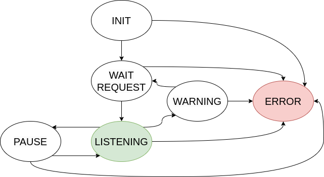

# NUCLEO Firmware Project – Potentiometer Acquisition with CLI and FSM

## Overview
This project implements firmware for an STM32 NUCLEO board to acquire data from a potentiometer, process it, and transmit it over serial communication. The system includes:

* **Analog acquisition** using ADC in DMA mode
* **Digital threshold detection** using GPIO interrupt
* **A Command Line Interface (CLI)** over UART
* **A Finite State Machine (FSM)** controlling system behavior
* **Optional data filtering**
* **Error handling and diagnostics**

Additionally, the system behavior is visualized through LED signals and serial output.

## Features

### Sensor Acquisition
* **Analog reading**: via ADC + DMA (continuous sampling).
* **Digital reading**: via GPIO interrupt (threshold-based signal).

### CLI Commands
The system supports three commands via UART:
* `raw`: No filtering applied.
* `moving average`: Applies a moving average filter with 150 samples.
* `random noise`: Adds artificial noise to the signal.

## System Architecture
The firmware is structured in modular components:
* **CLI module**: Parses user commands.
* **UART + DMA TX**: Non-blocking communication.
* **ADC + DMA**: Continuous analog acquisition.
* **GPIO EXTI**: Digital signal detection.
* **FSM**: Controls system logic.
* **Queue system**: Event-driven transitions.

## Finite State Machine (FSM)

The system behavior is controlled by the following states:
1. **INIT**
2. **WAIT REQUEST**
3. **LISTENING**
4. **PAUSE**
5. **WARNING**
6. **ERROR**

### FSM State Descriptions

#### Init
* Initializes all peripherals.

#### Wait Request
* CLI enabled.
* LED OFF.
* Sensor OFF.
* **Transition**: → `Button press` → **LISTENING**.

#### Listening
* CLI disabled.
* LED ON.
* Sensor active (ADC + digital).
* Data sent via UART.
* **Transition**: → `If digital signal HIGH for 5 seconds` → **WARNING**.
* **Transition**: → `Button press` → **PAUSE**.

#### Pause
* CLI enabled.
* LED blinking (2s period, 50% duty cycle).
* Sensor OFF.
* **Transition**: → `Button press` → **LISTENING**.

#### Warning
* CLI disabled.
* LED OFF.
* Sensor OFF.
* Serial output: "WARNING" (repeated).
* **Transition**: → `Button press` → **WAIT REQUEST**.

#### Error
* Triggered by any system error (e.g., HAL failure).
* CLI OFF.
* Sensor OFF.
* LED blinking (400ms period, 50% duty cycle).
* Serial output: "ERROR: <description>" (repeated).
* **Exit**: Only via software reset (USER BUTTON).